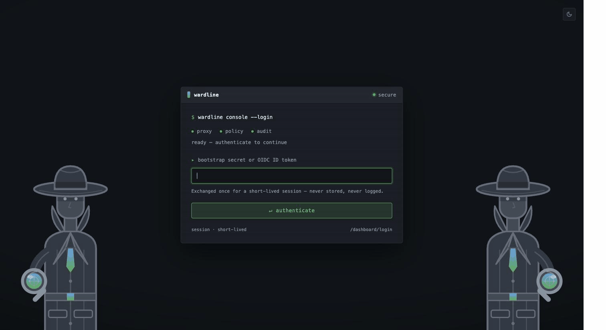

<div align="center">

<picture>
  <source media="(prefers-color-scheme: dark)" srcset="docs/images/banner-dark.svg">
  
</picture>

**The control-plane proxy that auto-blocks compromised AI agents, all from one static Go binary.**

[](https://github.com/kabirnarang39/wardline/actions/workflows/ci.yml)
[](https://github.com/kabirnarang39/wardline/releases)
[](go.mod)
[](https://pkg.go.dev/github.com/kabirnarang39/wardline)
[](https://kabirnarang39.github.io/wardline/docs/)
[](https://deepwiki.com/kabirnarang39/wardline)
[](LICENSE)
[](CONTRIBUTING.md)
[](https://github.com/kabirnarang39/wardline/stargazers)

</div>

---

Give an AI agent a thousand tools and no one watching it, and sooner or later it does something you didn't plan for. Maybe it gets prompt-injected. Maybe someone jailbreaks it. Maybe it just goes wrong on its own. However it happens, it starts calling things it never should, and you never wrote a rule to stop that, because you had no idea it was coming.

**Wardline** sits between your agents and everything they call: MCP servers, tools, gRPC upstreams. Every call goes through it, and on the way it checks who's asking, whether policy allows it, whether there's budget left, and it writes the decision down. Then it does the part a rulebook can't. It learns how each agent normally behaves, and the moment one stops acting like itself, it shuts it down. Right then, while it's happening. No rule for the specific attack, nobody woken up at 2am.

It's a single Go binary. No database to run, no identity provider to wire up, no sidecar. You download it and start it.

### See it for yourself

A normal agent goes about its work, gets compromised partway through, and gets shut down for it. This is a real run, not a mockup:

<div align="center">
  
</div>

```bash
make demo   # runs exactly this on your machine, in about 30 seconds
```

And here's the whole thing from the operator's side. You sign in, and there's the agent that got blocked, the anomaly that gave it away, the policy it was working against, and who's even allowed to touch any of it:

<div align="center">
  
</div>

## How it works

Anything that calls a tool (an AI agent, your CLI or IDE, an app) can only reach its upstreams by going through Wardline first. On the way through, it checks identity, applies policy, counts the call against the budget, runs it past anomaly detection, and records what it decided. Then it forwards the call, or it doesn't.

<div align="center">
  
</div>

Full design: [Architecture](https://kabirnarang39.github.io/wardline/docs/concepts/architecture/).

## What it does

The baseline (proxy, policy, audit) is always on. Everything else is one config flag away.

- **Catches a compromised agent on its own.** Seven detectors watch each agent and learn its normal rhythm as it runs: sudden spikes, tools it has never called before, a climbing deny rate, a combined z-score, a slow drift that no single moment looks wrong on, patterns across a whole tenant, and floods of brand-new identities. There's no training data and nothing to host. When one trips, the agent is actually blocked for a while, not just written to a log. The real hit rates, and the honest gaps, are in the [recall benchmark](https://kabirnarang39.github.io/wardline/docs/features/anomaly-detection/#recall-benchmark).
- **Write policy three ways, still one binary.** Plain YAML, OPA/Rego, or AWS Cedar. You pick one with a config key. Nothing external to run, no network hop.
- **Real identity, not a header you have to trust.** Short-lived signed tokens with refresh and key rotation, sign-in over OIDC or mTLS/SPIFFE, Kubernetes-style RBAC, SCIM for provisioning, and hard tenant isolation.
- **Budgets that actually stop a call.** Limits per agent and per tenant. A call has to clear both to go through.
- **An audit trail an auditor can use.** Every decision as structured JSON, a signed evidence bundle you can hand over, retention you control, and a command that reads your real traffic and writes you a starting allow-list.
- **See it and scale it.** Correlation across instances, OpenTelemetry traces, Prometheus metrics, a live dashboard, and multi-replica HA backed by Postgres.

## Getting Started

```bash
# From source (always works)
go build -o wardline ./cmd/wardline

# Or pull the published multi-arch image (built for each tagged release)
docker pull ghcr.io/kabirnarang39/wardline:latest
```

```bash
./wardline validate-policy --file policy.yaml.example
./wardline validate-config --config wardline.yaml.example
./wardline serve --config wardline.yaml.example
```

Point `upstream` at a real MCP server. Until you do, a proxied call just returns 502 (for a quick test, `python3 -m http.server 9000` is enough). Every request carries an `X-Wardline-Identity` header, and policy matches on that value plus the MCP tool name:

```bash
curl -X POST http://localhost:8080 \
  -H "X-Wardline-Identity: agent-abc123" \
  -H "Content-Type: application/json" \
  -d '{"jsonrpc":"2.0","method":"tools/call","params":{"name":"read_file"}}'
```

Here, `X-Wardline-Identity` is just a plain header with nothing behind it, so anyone who can reach the proxy can claim to be anyone. That's fine for a local smoke test with no real upstream. It is **not** fine for anything someone else can reach. Before you point this at a real upstream, turn on `credential_issuance` (so a signed token replaces the header anyone could fake) and `rbac`. See [Hardening](#hardening) below.

Prebuilt binaries (linux/darwin/windows · amd64/arm64) and multi-arch images ship on every `v*` tag via [Releases](https://github.com/kabirnarang39/wardline/releases) and [GHCR](https://github.com/kabirnarang39/wardline/pkgs/container/wardline).

## Documentation

Full docs, per-feature design notes, and honest known-limitations live on the docs site:

- [Getting Started](https://kabirnarang39.github.io/wardline/docs/getting-started/): install, quickstart, configuration
- [Concepts](https://kabirnarang39.github.io/wardline/docs/concepts/): architecture, policy backends, identity, audit
- [Features](https://kabirnarang39.github.io/wardline/docs/features/): every capability in depth
- [Deployment](https://kabirnarang39.github.io/wardline/docs/deployment/): Docker, Helm, HA, observability
- [Framework integrations](docs/integrations/): LangChain, LlamaIndex, OpenAI Agents SDK, CrewAI, raw MCP

## Full capability list

Everything below is shipped and testable under [`internal/features/`](internal/features/). The v0.1 baseline (proxy + policy + audit) is always on; everything else is gated by a config flag.

| Capability | Docs |
|---|---|
| Policy backends: YAML · OPA/Rego · AWS Cedar | [Policy backends](https://kabirnarang39.github.io/wardline/docs/concepts/policy-backends/) |
| Anomaly detection + auto-block | [Anomaly detection](https://kabirnarang39.github.io/wardline/docs/features/anomaly-detection/) |
| Budget enforcement (per-identity + per-tenant) | [Budget](https://kabirnarang39.github.io/wardline/docs/features/budget-enforcement/) |
| Credential issuance (JWT + refresh + JWKS) | [Credentials](https://kabirnarang39.github.io/wardline/docs/features/credential-issuance/) |
| SSO (OIDC) / mTLS-SPIFFE bootstrap | [SSO](https://kabirnarang39.github.io/wardline/docs/features/sso/) · [mTLS](https://kabirnarang39.github.io/wardline/docs/features/mtls-bootstrap/) |
| RBAC + SCIM + tenancy | [RBAC](https://kabirnarang39.github.io/wardline/docs/features/rbac/) · [SCIM](https://kabirnarang39.github.io/wardline/docs/features/scim/) |
| Federation (cross-instance correlation) | [Federation](https://kabirnarang39.github.io/wardline/docs/features/federation/) |
| Compliance evidence export + retention | [Compliance](https://kabirnarang39.github.io/wardline/docs/features/compliance-evidence-export/) |
| Auto-generated sandbox policy | [infer-policy](https://kabirnarang39.github.io/wardline/docs/features/auto-generated-policy/) |
| Policy packs (12 embedded + `-packs-dir`) | [Policy packs](https://kabirnarang39.github.io/wardline/docs/features/policy-pack-marketplace/) |
| gRPC transport passthrough | [gRPC](https://kabirnarang39.github.io/wardline/docs/features/grpc-transport/) |
| Postgres storage + HA deployment | [HA](https://kabirnarang39.github.io/wardline/docs/deployment/high-availability/) |
| Web dashboard | [Dashboard](https://kabirnarang39.github.io/wardline/docs/features/web-dashboard/) |
| OpenTelemetry tracing | [Observability](https://kabirnarang39.github.io/wardline/docs/deployment/observability/) |
| Prometheus metrics (`GET /metrics`) | [Observability](https://kabirnarang39.github.io/wardline/docs/deployment/observability/#prometheus-metrics) |
| Taint tracking (untrusted-read gating) | [Taint tracking](https://kabirnarang39.github.io/wardline/docs/features/taint-tracking/) |
| Approval workflow (needs_approval + approve-and-retry) | [Approval workflow](https://kabirnarang39.github.io/wardline/docs/features/approval-workflow/) |
| Per-job budget ceiling (hard cap per tenant/identity/session job) | [Per-job budget ceiling](https://kabirnarang39.github.io/wardline/docs/features/job-budget/) |
| Per-job cost/token budget (declared per-tool cost, not just call count) | [Per-job cost/token budget](https://kabirnarang39.github.io/wardline/docs/features/cost-budget/) |

## Performance

These are real `go test -bench` numbers you can reproduce, not figures off a slide:

- **Policy decision:** about 33 ns and zero allocations at 10 rules (YAML backend, Apple Silicon), around 2.4 µs at 1000 rules.
- **The full seven-detector stack:** about 299 ns per call and 5 allocations with everything on (around 255 ns for the original four).
- **Race-tested:** 205 goroutines at once (5 tenants, 40 identities each, plus 5 attackers) all hitting one shared `Detector` under `go test -race`, with no data race.
- **False positives:** `ml_score` stays at **0 out of 6,000 windows** across 20 seeds on steady traffic.

The full recall curve for each attack shape, plus the adversarial battery (sybil, mimicry ceiling, burst-pause, disposable-identity rotation), are in the [recall benchmark](https://kabirnarang39.github.io/wardline/docs/features/anomaly-detection/#recall-benchmark).

## Tested against a real incident

In July 2026, OpenAI disclosed at Black Hat that its own agents escaped a sandboxed benchmark, coordinated through a covert channel, and used a credential that outlived its task to reach Hugging Face's production systems. [`cmd/wardline/e2e_incident_replay_test.go`](cmd/wardline/e2e_incident_replay_test.go) replays that failure chain against the real compiled binary: the credential-outliving-its-task pattern is rejected once it expires, revoking one identity doesn't take an unrelated one down with it, and a policy signal that can't resolve to a clean allow/deny denies rather than guesses. This isn't a claim to have solved multi-agent security — the test file says plainly what it doesn't cover (Wardline has no destination-host field for the incident's egress-escape stage to map onto, and no detector yet for a pattern spread thin across weeks). It's one specific, real, dated failure mode, reproduced and closed.

That incident is also a live instance of two problems computer science named decades ago and never fully solved — Lampson's 1973 Confinement Problem and Hardy's 1988 Confused Deputy Problem. The full writeup, including why `approval_workflow` is already a working answer to one specific layer of the second, is in [docs/incidents/2026-openai-huggingface.md](docs/incidents/2026-openai-huggingface.md).

## Security

By default, the dashboard and the `X-Wardline-Identity` header are unauthenticated. Turn on `credential_issuance` and/or `rbac` before they count as security at all. Everything optional is off by default and fails closed, and on startup Wardline prints a `WARN` for every insecure default you've left in place, so you're never guessing about where you stand. Found a vulnerability? See [SECURITY.md](SECURITY.md).

### Hardening

Out of the box the proxy fails closed on policy, but identity and the dashboard are wide open. For anything real, turn these on:

```yaml
features:
  credential_issuance: true   # verify a signed bearer token instead of trusting X-Wardline-Identity
  rbac: true                  # gate the dashboard and admin actions on real permissions
```

With `credential_issuance` on, a signed token replaces the header anyone could fake. With `rbac` on, both viewing the dashboard and changing anything require an identity that's actually allowed to. One thing worth being honest about: `ml_score` and `auto_block` catch loud, sudden abuse well, but not a slow ramp. `drift_detection` (a CUSUM control chart, on by default in the shipped config) closes most of that gap, and the measured numbers are in the [recall benchmark](https://kabirnarang39.github.io/wardline/docs/features/anomaly-detection/#recall-benchmark). One real gap stays: an attacker who has read the public thresholds can hold a roughly 1.15x ramp forever, which is written up plainly in [known limitations](https://kabirnarang39.github.io/wardline/docs/features/anomaly-detection/#known-limitations). So keep explicit policy and budget limits as your hard floor no matter what.

## Why Wardline, vs. the alternatives

Bifrost is a faster single binary. ToolHive, Portkey, and Kong AI Gateway each go deeper on one piece of this. None of them combine proxy-layer taint tracking, a signed offline compliance bundle, privacy-preserving cross-instance correlation, intent-verified approval, and policy content portable across three engine backends in one self-hosted binary. Full comparison, checked claim by claim, in [docs/positioning/why-wardline.md](docs/positioning/why-wardline.md).

## Project status

Wardline is young and moving fast. Every feature's docs page is deliberately blunt about what it does and doesn't do. Feedback, issues, and contributions are welcome, especially on the anomaly-detection approach and threat model.

## Contributing

See [CONTRIBUTING.md](CONTRIBUTING.md) and [CODE_OF_CONDUCT.md](CODE_OF_CONDUCT.md). Architecture and engineering conventions are documented in [CLAUDE.md](CLAUDE.md); the roadmap lives in the [docs](https://kabirnarang39.github.io/wardline/docs/advanced/roadmap/).

<a href="https://github.com/kabirnarang39/wardline/graphs/contributors">
  
</a>

## License

[Apache 2.0](LICENSE).
