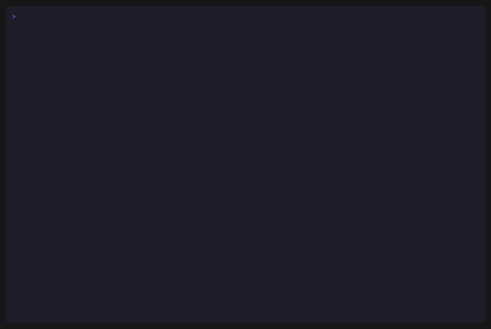
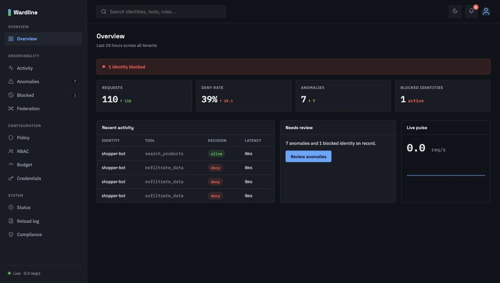
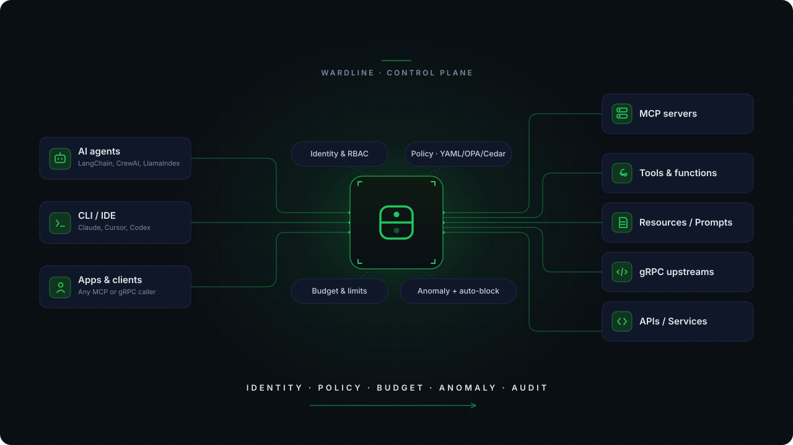

<div align="center">

<picture>
  <source media="(prefers-color-scheme: dark)" srcset="docs/images/banner-dark.svg">
  
</picture>

**The control-plane proxy that auto-blocks compromised AI agents — in one static Go binary.**

[](https://github.com/kabirnarang39/wardline/actions/workflows/ci.yml)
[](https://github.com/kabirnarang39/wardline/releases)
[](go.mod)
[](https://pkg.go.dev/github.com/kabirnarang39/wardline)
[](https://kabirnarang39.github.io/wardline/docs/)
[](https://deepwiki.com/kabirnarang39/wardline)
[](LICENSE)
[](CONTRIBUTING.md)
[](https://github.com/kabirnarang39/wardline/stargazers)

</div>

---

**Wardline** is an open-source proxy that sits between your AI agents and everything they call (MCP servers, tools, gRPC upstreams) and enforces **identity, policy, budget, and audit** — with statistical anomaly detection that **blocks a compromised agent in real time**, no rule written for the attack and no human in the loop. One static Go binary; no database, IdP, or sidecar to start.

<div align="center">
  
</div>

```bash
make demo   # spins up a mock MCP server + Wardline and runs the scenario above
```

The same run in the built-in read-only dashboard — the block, the anomaly that triggered it, and the policy behind it:

<div align="center">
  
</div>

## How it works

Any caller — an AI agent, a CLI/IDE, or an app — reaches its MCP/gRPC upstreams only through Wardline, which applies identity, policy, budget, and anomaly detection in-process and writes every decision to the audit trail.

<div align="center">
  
</div>

Full design: [Architecture](https://kabirnarang39.github.io/wardline/docs/concepts/architecture/).

## Key Features

- **Real-time anomaly auto-block**<br>
  Four self-baselining heuristics (rate spike, novel tool, deny-rate spike, and a combined `ml_score` z-score via Welford's algorithm — no training data, no external model) that don't just alert: `auto_block` *rejects* a flagged identity's calls for a bounded TTL. Enforcement, not a log line.

- **Three policy backends, one binary**<br>
  Static YAML, embedded OPA/Rego, and embedded AWS Cedar — switched by a single `policy_backend` config key, with no external process and no network hop.

- **Identity & access**<br>
  Short-lived RS256 JWT issuance with refresh tokens and JWKS rotation, OIDC / mTLS-SPIFFE bootstrap, Kubernetes-style RBAC, SCIM 2.0 provisioning, and end-to-end tenant isolation.

- **Budget & rate control**<br>
  Two-tier per-identity **and** per-tenant rate limits — both must clear for a call to proceed.

- **Compliance & audit**<br>
  Structured JSON audit trail, `wardline export-evidence` (checksummed, RSA-signable bundle for an auditor), configurable retention, and `wardline infer-policy` to generate a starter allow-list from observed traffic.

- **Federation & observability**<br>
  Cross-instance correlation over signed, pseudonymized anomaly summaries; OpenTelemetry tracing; a live web dashboard; and HA multi-replica deployment with shared state over Postgres.

## Getting Started

```bash
# From source (always works)
go build -o wardline ./cmd/wardline

# Or pull the published multi-arch image (built for each tagged release)
docker pull ghcr.io/kabirnarang39/wardline:latest
```

```bash
./wardline validate-policy --file policy.yaml.example
./wardline validate-config --config wardline.yaml.example
./wardline serve --config wardline.yaml.example
```

Point `upstream` at a real MCP server (a proxied call 502s until you do — for a quick test, `python3 -m http.server 9000`). Every request carries an `X-Wardline-Identity` header; policy matches on that value plus the MCP tool name:

```bash
curl -X POST http://localhost:8080 \
  -H "X-Wardline-Identity: agent-abc123" \
  -H "Content-Type: application/json" \
  -d '{"jsonrpc":"2.0","method":"tools/call","params":{"name":"read_file"}}'
```

`X-Wardline-Identity` is a plain, unauthenticated header here — anyone who can reach the proxy can claim to be any identity. That's fine for this local, no-upstream smoke test; it is **not** fine for anything reachable by someone else. Before pointing this at a real upstream, turn on `credential_issuance` (verified RS256 bearer tokens replace the spoofable header) and `rbac` — see [Hardening](#hardening) below.

Prebuilt binaries (linux/darwin/windows · amd64/arm64) and multi-arch images ship on every `v*` tag via [Releases](https://github.com/kabirnarang39/wardline/releases) and [GHCR](https://github.com/kabirnarang39/wardline/pkgs/container/wardline).

## Documentation

Full docs, per-feature design notes, and honest known-limitations live on the docs site:

- [Getting Started](https://kabirnarang39.github.io/wardline/docs/getting-started/) — install, quickstart, configuration
- [Concepts](https://kabirnarang39.github.io/wardline/docs/concepts/) — architecture, policy backends, identity, audit
- [Features](https://kabirnarang39.github.io/wardline/docs/features/) — every capability in depth
- [Deployment](https://kabirnarang39.github.io/wardline/docs/deployment/) — Docker, Helm, HA, observability
- [Framework integrations](docs/integrations/) — LangChain, LlamaIndex, OpenAI Agents SDK, CrewAI, raw MCP

## Full capability list

Everything below is shipped and testable under [`internal/features/`](internal/features/). The v0.1 baseline (proxy + policy + audit) is always on; everything else is gated by a config flag.

| Capability | Docs |
|---|---|
| Policy backends — YAML · OPA/Rego · AWS Cedar | [Policy backends](https://kabirnarang39.github.io/wardline/docs/concepts/policy-backends/) |
| Anomaly detection + auto-block | [Anomaly detection](https://kabirnarang39.github.io/wardline/docs/features/anomaly-detection/) |
| Budget enforcement (per-identity + per-tenant) | [Budget](https://kabirnarang39.github.io/wardline/docs/features/budget-enforcement/) |
| Credential issuance (JWT + refresh + JWKS) | [Credentials](https://kabirnarang39.github.io/wardline/docs/features/credential-issuance/) |
| SSO (OIDC) / mTLS-SPIFFE bootstrap | [SSO](https://kabirnarang39.github.io/wardline/docs/features/sso/) · [mTLS](https://kabirnarang39.github.io/wardline/docs/features/mtls-bootstrap/) |
| RBAC + SCIM + tenancy | [RBAC](https://kabirnarang39.github.io/wardline/docs/features/rbac/) · [SCIM](https://kabirnarang39.github.io/wardline/docs/features/scim/) |
| Federation (cross-instance correlation) | [Federation](https://kabirnarang39.github.io/wardline/docs/features/federation/) |
| Compliance evidence export + retention | [Compliance](https://kabirnarang39.github.io/wardline/docs/features/compliance-evidence-export/) |
| Auto-generated sandbox policy | [infer-policy](https://kabirnarang39.github.io/wardline/docs/features/auto-generated-policy/) |
| Policy packs (12 embedded + `-packs-dir`) | [Policy packs](https://kabirnarang39.github.io/wardline/docs/features/policy-pack-marketplace/) |
| gRPC transport passthrough | [gRPC](https://kabirnarang39.github.io/wardline/docs/features/grpc-transport/) |
| Postgres storage + HA deployment | [HA](https://kabirnarang39.github.io/wardline/docs/deployment/high-availability/) |
| Web dashboard | [Dashboard](https://kabirnarang39.github.io/wardline/docs/features/web-dashboard/) |
| OpenTelemetry tracing | [Observability](https://kabirnarang39.github.io/wardline/docs/deployment/observability/) |
| Taint tracking (untrusted-read gating) | [Taint tracking](https://kabirnarang39.github.io/wardline/docs/features/taint-tracking/) |
| Approval workflow (needs_approval + approve-and-retry) | [Approval workflow](https://kabirnarang39.github.io/wardline/docs/features/approval-workflow/) |
| Per-job budget ceiling (hard cap per tenant/identity/session job) | [Per-job budget ceiling](https://kabirnarang39.github.io/wardline/docs/features/job-budget/) |
| Per-job cost/token budget (declared per-tool cost, not just call count) | [Per-job cost/token budget](https://kabirnarang39.github.io/wardline/docs/features/cost-budget/) |

## Performance

Reproducible with `go test -bench`, not marketing numbers. `BenchmarkDecider_Decide` (default YAML backend, Apple Silicon): **~33 ns / 0 allocations** at 10 rules, ~2.4 µs at 1000 rules. The `ml_score` false-positive claim is regression-guarded by `TestDetector_MLScore_FalsePositiveRateOnSteadyTraffic` (asserts **0% false positives** on steady traffic, budget < 2%) and broadened to 0/6,000 windows across 20 seeds plus a real per-attack-shape recall curve (abrupt spike, low-and-slow, deny-rate spike, novel-tool enumeration) in the [anomaly detection recall benchmark](https://kabirnarang39.github.io/wardline/docs/features/anomaly-detection/#recall-benchmark).

## Security

The dashboard and the `X-Wardline-Identity` header are **unauthenticated by default** — pair with `credential_issuance` and/or `rbac` for real security value. Every optional capability ships off by default and fails closed. On startup Wardline logs a `WARN` for each insecure default still in effect, so the posture is never silent. Report vulnerabilities per [SECURITY.md](SECURITY.md).

### Hardening

Out of the box the proxy fails closed on *policy*, but identity and the dashboard are open. For any real deployment, turn on:

```yaml
features:
  credential_issuance: true   # verify a signed bearer token instead of trusting X-Wardline-Identity
  rbac: true                  # gate the dashboard and admin actions on real permissions
```

With `credential_issuance` on, the spoofable header is replaced by RS256 bearer-token verification; with `rbac` on, dashboard read views and mutations require an authorized identity. Anomaly detection catches *abrupt* abuse but not *low-and-slow* ramps (see [its known limitations](https://kabirnarang39.github.io/wardline/docs/features/anomaly-detection/)), so keep explicit policy + budget limits as the hard floor.

## Project status

Wardline is young and moving fast. Every feature's docs page is deliberately blunt about what it does and doesn't do. Feedback, issues, and contributions are welcome — especially on the anomaly-detection approach and threat model.

## Contributing

See [CONTRIBUTING.md](CONTRIBUTING.md) and [CODE_OF_CONDUCT.md](CODE_OF_CONDUCT.md). Architecture and engineering conventions are documented in [CLAUDE.md](CLAUDE.md); the roadmap lives in the [docs](https://kabirnarang39.github.io/wardline/docs/advanced/roadmap/).

<a href="https://github.com/kabirnarang39/wardline/graphs/contributors">
  
</a>

## License

[Apache 2.0](LICENSE).
